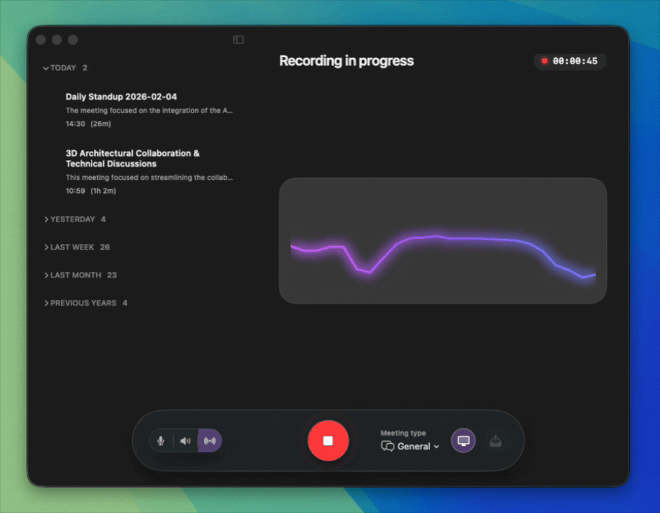

<h1 align="center">
  <br>
  
  <br>
  Minute
  <br>
</h1>

<h4 align="center">Capture meetings, voice memos, videos, and system audio directly into your Obsidian Vault. 100% Local. Zero Monthly Fees.</h4>

<p align="center">
  
  
  
</p>

<p align="center">
  <a href="#key-features">Key Features</a> •
  <a href="#output-contract">Output Contract</a> •
  <a href="#how-to-build">How to Build</a> •
  <a href="#testing">Testing</a> •
  <a href="#privacy">Privacy</a> •
  <a href="#docs">Docs</a>
</p>

<p align="center">
  
</p>

## Install (Homebrew)
```
brew tap roblibob/minute
brew install --cask minute
```

## Install (Manual)
1. Download the latest DMG from GitHub Releases.
2. Open the DMG and drag `Minute.app` into Applications.
3. Launch Minute from Applications.

## Key Features

### Total Audio Capture
* **System Audio & Mic Mixed:** Record your Zoom calls, Google Meets, or Discord chats directly. No virtual audio cables or "bot" participants required.
* **Process video:** Turn already recorded video files into summaries.
* **Live Waveform:** Visual feedback confirms you are capturing audio in real-time.

### Vision-Enhanced Context
* **See What Was Said:** Minute can optionally capture and understand screen context snapshots during recording.
* **Disambiguation:** If a speaker refers to "this chart" or "that code block," the AI uses the visual context to write a more accurate summary.

### Deterministic Obsidian Output
* **No "Wall of Text":** Unlike generic chat bots, Minute uses constrained JSON generation to force the LLM into a strict schema.
* **Vault-Ready:** Writes directly to your local folder.
    * ✅ Valid YAML Frontmatter (Date, Tags, Duration).
    * ✅ Clean Markdown headers and properties.
    * ✅ Links to the full transcript and audio for reference.

### 100% Private & Offline
* **Apple Silicon Native:** Runs `Fluidaudio/Parakeet` (for transcription) and `Llama/Gemma 3` (for screen context and summarization) entirely on your Mac's Neural Engine.
* **Zero Data Leak:** Unplug your ethernet cable—it still works. Your meetings never touch a server.


## Why I Built Minute
I live in Obsidian, but I was frustrated by the state of AI tools for macOS.

Most existing solutions forced me into one of two compromises:
1.  **Privacy Trade-offs:** Sending my private journals and meeting notes to cloud APIs (OpenAI/Anthropic) felt wrong and is often not acceptable for my clients.
2.  **The Workflow Gap:** Most tools just dump text. Minute is engineered to produce *structured data* that actually fits into my workflow.

I built **Minute** to be the tool I wanted to use: a **native, lightweight Swift application** that respects the "Local-First" philosophy of Obsidian. It runs entirely on your device, uses your Mac's dedicated Neural Engine, and never asks for a credit card. It has one purpose and does it well.

## Comparison

| Feature | ⚡️ Minute | ☁️ Other tools
| :--- | :--- | :--- | 
| **Privacy** | ✅ **Local (Device Only)** | ❌ Cloud Processed | 
| **Cost** | ✅ **Free / OSS** | ❌ $10–$30/mo | 
| **Audio Source** | ✅ **Mic + System Audio** | ❌ Requires "Bot" to join(usually) |
| **Workflow** | ✅ **Direct Vault Write** | ❌ Copy/Paste required | 
| **Latency** | ✅ **Real-time (On-chip)** | ❌ Network Lag | 
| **Context** | ✅ **👀 Vision/Screen Aware** | ❌ Audio Only |

## Output example
```
---
type: meeting
date: Jan 22, 2026 at 21:46
title: "Zoom Kitten Filter Incident - 27th Judicial District"
source: "Minute"
length: 1m
tags:
---

# Zoom Kitten Filter Incident - 27th Judicial District

## Summary
During a court hearing in the 27th Judicial District, Rod Ponton experienced a persistent Zoom kitten filter on his video feed. Despite attempts to remove it with assistance from his assistant, the issue remained unresolved. The judge highlighted the potential for recording violations and issued a warning about prohibited recordings. No formal decisions were made regarding the filter.

## Decisions

## Action Items
- [ ] Ensure Zoom video settings are configured correctly to prevent filter activation. (Owner: Rod Ponton)

## Open Questions
- What specific steps were taken to remove the filter?

## Key Points
- A Zoom kitten filter was present during the court hearing.
- The judge cautioned against recording the proceedings.
- Mr. Ponton was unable to resolve the filter issue independently.

## Transcript
[[Meetings/_transcripts/2026-01-22 20.45 - Zoom Kitten Filter Incident - 27th Judicial District.md]]

```

## Requirements
- macOS 14+
- Apple Silicon (M1 or newer)

## Privacy
- Audio and inference stay local.
- No outbound network calls except model downloads.

## Contributing
See `CONTRIBUTING.md`.

## Security
See `SECURITY.md`.

## License
MIT. See `LICENSE`.
